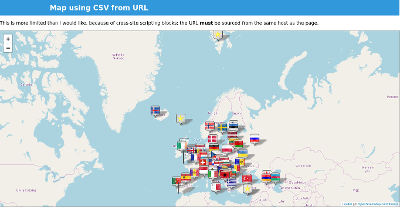

A couple of weeks ago, someone came to me with a problem. She had data in a spreadsheet. She wanted to display it as a map, on a website. And she wanted to be able to do that dynamically - that is to say, she wanted the map on the website to update as the spreadsheet changed.

So there were clear routes to several of the parts of this problem:

1. If you need maps on a web page, you need [Leaflet](https://leafletjs.com/) - it's a simply wonderful library;
2. If you want a spreadsheet that is live on the Internet, [Google Sheets](https://developers.google.com/sheets) are a very good way to go;
3. Google Sheets allows export as Comma-Separated Values, and CSV is a very easy format to parse.

I needed to do this quickly, so I started in my comfort zone, using Dmitri Sotnikov's [Luminus](framework) and mixing in the [Day8 re-frame](https://github.com/day8/re-frame) framework, in order to have a lot of built-in functionality client side. The joy of the [Clojure](https://clojure.org/) development tools is that getting a working system is as easy as typing

    lein new luminus geocsv +re-frame
		
And from that point on you can do your development with your system live, and can see the effects of every change you make immediately.

So within a couple of days I had a polished wee system which looked good and pulled live data from a Google Sheets spreadsheet to populate a map, with different graphical pins for her different classes of records. It was highly reusable, since you can specify the document id of any public Google sheet in the query part of the URL, and that sheet will be rendered. The map automatically pans and zooms to focus on the data provided. Was I pleased? Well, sort of.

Why was I not pleased? The deliverable component is an executable jar file, and it's 58 megabytes; in the browser, client-side, a page consumes 10 megabytes of memory. That seems huge for such a simple piece of functionality. I'd satisfied the requirement, but I hadn't satisfied myself. Also, of course, it needed you to be able to run a component on your web server, and many organisations with simple web hosting can't do that.

## Doing it again, better

So I started again. This time I did it entirely client-side, just ClojureScript, with no heavywieght libraries. Having solved the problem once, it was pretty easy to do it again, and within a day I had a system working. Furthermore, I added flexibility: you can supply a URL, as before; or as the text of the document element that the map overlays; or passed as a string to the function. You can see it [here](https://simon-brooke.github.io/geocsv-lite/).

Was I pleased?

No.

Three things about this solution don't satisfy me.

Firstly, the deliverable (jar archive, for direct comparison with the original) is still 2.9 megabytes. That's only 5% of the size of the original, and includes the whole of Leaflet, the whole of [Papaparse](https://www.papaparse.com/) - a client side CSV parser, and 398 different map pin images, but it still seems big. Page load - with the three maps on the demo page - costs around 5 megabytes in the browser.

Secondly, because it's client-side only, it cannot know what pin images are available on the server; so if there is a category value in the data for which no pin image is available on the server, you will get a 'broken image' appearing on the map, which is ugly.

Thirdly and most significantly, again because it's client side only, modern cross-site scripting protections mean that it cannot pull data from a spreadsheet hosted on another site - so it doesn't strictly meet the original requirement.

## Iterating again

I decided to look at whether I could make it smaller by abandoning the comfort of the Clojure environment and writing pure JavaScript. This led to a third iteration, geocsv-js, which you can see in action here. The amount of 'my code' in this version is far lighter - the output of the ClojureScript compiler for geocsv-lite comes to 6.6 megabytes uncompressed, whereas the pure JavaScript version is one file of just 8.8 kilobytes in 296 source lines of code (for comparison, the ClojureScript solution, geocsv-lite, comes to 372 source lines of code). One reason for the slightly larger size of the ClojureScript solution is that it has a better algorithm for panning and zooming the map to display the data actually entered, which I didn't port to JavaScript.

But what is bizarre and I do not yet understand is that the deliverable is not smaller but bigger than the geocsv-lite deliverable, by almost twice - 4.7 megabytes - despite using identically the same libraries. Still more surprising, the memory consumption in the browser is also higher, at around 6 megabytes.

What are the lessons learned? Well, the overhead of using ClojureScript is not nearly as much as I thought it was. There is something clearly wrong about the discrepancy between the size of the packaged deliverables - the pure JavaScript variant must be including third party data which the ClojureScript variant doesn't, although I haven't yet tracked down what this is - but the in-browser memory footprint is actually smaller, and the page load time is, as best as I can measure, identical at about five seconds.

Was I satisfied now? Well, sort of.

## Merits and demerits

All three variants have merits. The first pulls the data directly from Google Sheets, which was the original requirement, and served a default pin image for any record category for which it didn't have a matching image. That made it a lot slicker to use, and more forgiving of user error. The two client-side-only variants cannot do those things, for reasons which I have not found ways to solve. But they don't need any server-side functionality beyond the dumb serving of files, so they're much easier to deploy; they are also less greedy of client side resources.

## One more time with feeling

One of the reasons why I get hammering at this problem was that I felt it would make a really useful extension for my wiki engine, [Smeagol](https://github.com/journeyman-cc/smeagol). I've integrated the JavaScript version, geocsv-js, and in doing that I've solved a number of problems. Firstly, the look and feel and content of Smeagol pages is flexible and easily configurable by the user, so it doesn't take a geek to set up a page with the content you want and a map of the data you want to show. Secondly, the Smeagol engine, because it sits server side, can pull data from remote sites, and because it doesn't interpret that data, there's no significant risk in doing that. Thirdly, again because it sits server side, it can deal with the issue of unknown images - and, because it's a wiki engine targeting less technical users, I've deliberately made it very graceful about how it does this.

So now, instead of just a map on a web page, you get a whole, richly editable website, with existing extensions to integrate sophisticated data visualisation and photograph galleries as well as maps. And the cost of this? Surprisingly little more. A Smeagol page with one map uses exactly the same memory on the client as a geocsv-js page with one map, because Smeagol now only loads JavaScript for extensions actually being used in the page, and almost all of its own functionality runs server side. But even server side, the cost is not very much greater than for the full fat geocsv implementation - the deliverable jar file, which offers far more functionality than geocsv, is only 88 megabytes. Considering how much more usability and flexibility this offers, this is the version of geocsv I'd now offer, if someone came to me with the same problem.