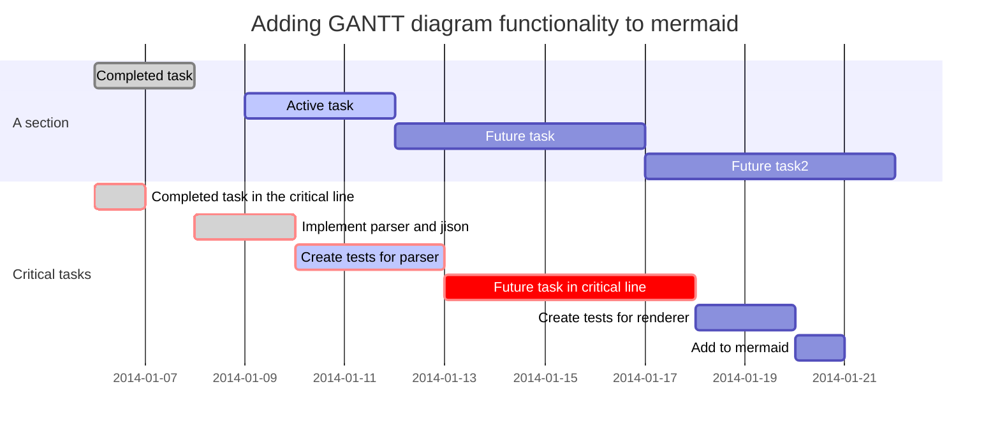

The basic format of Smeagol pages is [Markdown](https://daringfireball.net/projects/markdown/); documentation on how to format them is [here](https://daringfireball.net/projects/markdown/syntax). Note that there are a number of slightly different variants of Markdown; the version used by Smeagol does not currently allow tables.

A system of pluggable, extensible formatters is supported. In normal markdown, code blocks may be delimited by three backticks at start and end, and often the syntax of the code can be indicated by a token immediately following the opening three backticks. This has been extended to allow custom formatters to be provided for such code blocks. Two example formatters are provided:

## The Vega formatter

Inspired by [visdown](http://visdown.amitkaps.com/) and [vega-lite](https://vega.github.io/vega-lite/docs/), the Vega formatter allows you to embed vega data visualisations into Smeagol pages. The graph description should start with a line comprising three back-ticks and then the word '`vega`', and end with a line comprising just three backticks.

Here's an example cribbed in its entirety from [here](http://visdown.amitkaps.com/london):

### Flight punctuality at London airports

```vega
data:
  url: "data/london.csv"
transform:
 -
  filter: datum.year == 2016
mark: rect
encoding:
  x:
    type: nominal
    field: source
  y:
    type: nominal
    field: dest
  color:
    type: quantitative
    field: flights
    aggregate: sum
```

Data files can be uploaded in the same way as images, by using the **upload a file** link.

## The Mermaid formatter

Graphs can now be embedded in a page using the [Mermaid](http://knsv.github.io/mermaid/index.html) graph description language. The graph description should start with a line comprising three back-ticks and then the word `mermaid`, and end with a line comprising just three backticks.

Here's an example culled from the Mermaid documentation.

### GANTT Chart



## Writing your own custom formatters

A custom formatter is simply a Clojure function which takes a string and an integer as arguments and produces a string as output. The string is the text the user has typed into their markdown; the integer is simply a number you can use to keep track of which addition to the page this is, in order, for example, to fix up some JavaScript to render it.

For example, here's the formatter which handles the Vega charts:

    (defn process-vega
      "Process this `vega-src` string, assumed to be in YAML format, into a specification
       of a Vega chart, and add the plumbing to render it."
      [^String vega-src ^Integer index]
      (str
        "<div class='data-visualisation' id='vis" index "'></div>\n"
        "<script>\n//<![CDATA[\nvar vl"
        index
        " = "
        (yaml->json (str "$schema: https://vega.github.io/schema/vega-lite/v2.json\n" vega-src))
        ";\nvega.embed('#vis"
        index
        "', vl"
        index
        ");\n//]]\n</script>"))

### Configuring Smeagol to use your formatter

To add your own formatter, compile it into a jar file which is on the classpath - it does *not* have to be part of the Smeagol project directly - and then edit the value of the key `:formatters` in the file `config.edn`; whose standard definition is:

     :formatters        {"vega"     smeagol.formatting/process-vega
                         "vis"      smeagol.formatting/process-vega
                         "mermaid"  smeagol.formatting/process-mermaid}

The added key should be the word which will follow the opening three backticks of your code block, and the value of that key should be a symbol which evaluates to the function you have written. So suppose your formatter was called `my-magic-formatter`; you'd written it in a namespace called `magic.core`; and you wanted users to identify it with the word `magic`, you'd add the following to the `:formatters` map:

    "magic" magic.core/my-magic-formatter

Users could then put a section in their markdown text:

```backticks magic
    wingardium leviosa
```

and your function would be called with "wingardium leviosa" as the first argument.
