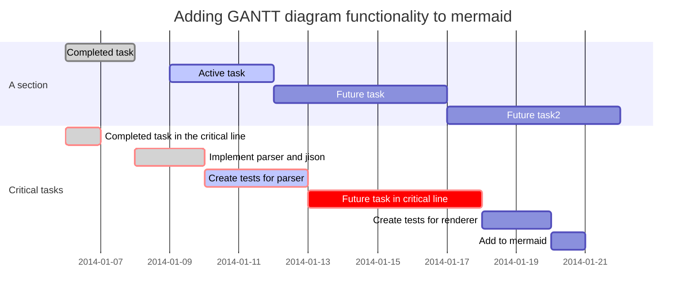

The basic format of Smeagol pages is [Markdown](https://daringfireball.net/projects/markdown/); documentation on how to format them is [here](https://daringfireball.net/projects/markdown/syntax). Note that there are a number of slightly different variants of Markdown; the version used by Smeagol does not currently allow tables.

A system of pluggable, extensible formatters is supported. In normal markdown, code blocks may be delimited by three backticks at start and end, and often the syntax of the code can be indicated by a token immediately following the opening three backticks. This has been extended to allow custom formatters to be provided for such code blocks. Example formatters are provided:

## The GeoCSV formatter

Allows you to embed maps with markers on them into Wiki pages. To embed a map, start with a line comprising three backticks and the word '`geocsv`', then as many lines as you like with comma-separated values (CSV) data to show on your map, followed by a line comprising just three backticks and nothing else.

The CSV must have the column titles in the first line, and must have columns called `latitude` and `longitude`, which must both contain floating point numbers, not degrees, minutes and seconds. The CSV *may* also have a column called `name`, which will be used as the heading for the popup that shows if you click an image, and a column named category. If the category column is present, and contains a value in a given row, the marker image for the marker for that row will the uploaded file whose name is that value followed by `-pin.png`.

Here's an example: the capital cities of Europe. You can use local links in the CSV values, as you will see if you select the pin on Iceland, but not in the column titles.

```geocsv
Country,Name,Latitude,Longitude,CountryCode,Continent,Category
Aland Islands,Mariehamn,60.116667,19.9,AX,Europe,
Albania,Tirana,41.3166666666667,19.816667,AL,Europe,AL
Andorra,Andorra la Vella,42.5,1.516667,AD,Europe,AD
Armenia,Yerevan,40.1666666666667,44.5,AM,Europe,AM
Austria,Vienna,48.2,16.366667,AT,Europe,AT
Azerbaijan,Baku,40.3833333333333,49.866667,AZ,Europe,AZ
Belarus,Minsk,53.9,27.566667,BY,Europe,BY
Belgium,Brussels,50.8333333333333,4.333333,BE,Europe,BE
Bosnia and Herzegovina,Sarajevo,43.8666666666667,18.416667,BA,Europe,BA
Bulgaria,Sofia,42.6833333333333,23.316667,BG,Europe,BG
Croatia,Zagreb,45.8,16,HR,Europe,HR
Cyprus,Nicosia,35.1666666666667,33.366667,CY,Europe,CY
Czech Republic,Prague,50.0833333333333,14.466667,CZ,Europe,CZ
Denmark,Copenhagen,55.6666666666667,12.583333,DK,Europe,DK
Estonia,Tallinn,59.4333333333333,24.716667,EE,Europe,EE
Faroe Islands,Torshavn,62,-6.766667,FO,Europe,
Finland,Helsinki,60.1666666666667,24.933333,FI,Europe,FI
France,Paris,48.8666666666667,2.333333,FR,Europe,FR
Georgia,Tbilisi,41.6833333333333,44.833333,GE,Europe,GE
Germany,Berlin,52.5166666666667,13.4,DE,Europe,DE
Gibraltar,Gibraltar,36.1333333333333,-5.35,GI,Europe,GI
Greece,Athens,37.9833333333333,23.733333,GR,Europe,GR
Guernsey,Saint Peter Port,49.45,-2.533333,GG,Europe,GG
Vatican City,Vatican City,41.9,12.45,VA,Europe,VA
Hungary,Budapest,47.5,19.083333,HU,Europe,HU
[[Iceland]],Reykjavik,64.15,-21.95,IS,Europe,IS
Ireland,Dublin,53.3166666666667,-6.233333,IE,Europe,IE
Isle of Man,Douglas,54.15,-4.483333,IM,Europe,IM
Italy,Rome,41.9,12.483333,IT,Europe,IT
Jersey,Saint Helier,49.1833333333333,-2.1,JE,Europe,JE
Kosovo,Pristina,42.6666666666667,21.166667,KO,Europe,
Latvia,Riga,56.95,24.1,LV,Europe,LV
Liechtenstein,Vaduz,47.1333333333333,9.516667,LI,Europe,LI
Lithuania,Vilnius,54.6833333333333,25.316667,LT,Europe,LT
Luxembourg,Luxembourg,49.6,6.116667,LU,Europe,LU
Macedonia,Skopje,42,21.433333,MK,Europe,MK
Malta,Valletta,35.8833333333333,14.5,MT,Europe,MT
Moldova,Chisinau,47,28.85,MD,Europe,MD
Monaco,Monaco,43.7333333333333,7.416667,MC,Europe,MC
Montenegro,Podgorica,42.4333333333333,19.266667,ME,Europe,ME
Netherlands,Amsterdam,52.35,4.916667,NL,Europe,NL
Norway,Oslo,59.9166666666667,10.75,NO,Europe,NO
Poland,Warsaw,52.25,21,PL,Europe,PL
Portugal,Lisbon,38.7166666666667,-9.133333,PT,Europe,PT
Romania,Bucharest,44.4333333333333,26.1,RO,Europe,RO
Russia,Moscow,55.75,37.6,RU,Europe,RU
San Marino,San Marino,43.9333333333333,12.416667,SM,Europe,SM
Serbia,Belgrade,44.8333333333333,20.5,RS,Europe,RS
Slovakia,Bratislava,48.15,17.116667,SK,Europe,SK
Slovenia,Ljubljana,46.05,14.516667,SI,Europe,SI
Spain,Madrid,40.4,-3.683333,ES,Europe,ES
Svalbard,Longyearbyen,78.2166666666667,15.633333,SJ,Europe,
Sweden,Stockholm,59.3333333333333,18.05,SE,Europe,SE
Switzerland,Bern,46.9166666666667,7.466667,CH,Europe,CH
Turkey,Ankara,39.9333333333333,32.866667,TR,Europe,TR
Ukraine,Kyiv,50.4333333333333,30.516667,UA,Europe,UA
United Kingdom,London,51.5,-0.083333,GB,Europe,GB
Northern Cyprus,North Nicosia,35.183333,33.366667,NULL,Europe,

```

Read more about [[Data on maps]].

## The Vega formatter

Inspired by [visdown](https://visdown.com/) and [vega-lite](https://vega.github.io/vega-lite/docs/), the Vega formatter allows you to embed vega data visualisations into Smeagol pages. The graph description should start with a line comprising three back-ticks and then the word '`vega`', and end with a line comprising just three backticks.

Here's an example cribbed in its entirety from [here](http://visdown.amitkaps.com/london):

### Flight punctuality at London airports

```vega
data:
  url: "data/london.csv"
transform:
 -
  filter: datum.year == 2016
mark: rect
encoding:
  x:
    type: nominal
    field: source
  y:
    type: nominal
    field: dest
  color:
    type: quantitative
    field: flights
    aggregate: sum
```

Data files can be uploaded in the same way as images, by using the **upload a file** link.

## The Mermaid formatter

Graphs can now be embedded in a page using the [Mermaid](https://mermaid-js.github.io/mermaid/#/) graph description language. The graph description should start with a line comprising three back-ticks and then the word `mermaid`, and end with a line comprising just three backticks.

Here's an example culled from the Mermaid documentation. Edit this page to see the specification.

### GANTT Chart



Mermaid graph specifications can also be loaded from URLs. Here's another example; again, edit this page to see how the trick is done.

### Class Diagram

```mermaid
data/classes.mermaid
```

## Photoswipe galleries

Not so much a formatter, this is an extension to allow you to embed image galleries in your markdown. To specify a gallery, use three backticks followed by `pswp`, followed on the following lines by a [Photoswipe](https://photoswipe.com/documentation/getting-started.html) specification in [JSON](https://www.json.org/json-en.html)
followed by three backticks on a line by themselves. There is an [[Example gallery]] with the full PhotoSwipe configuration, and a [[Simplified example gallery]] using a much simpler syntax, so that you can see how this works.

## Writing your own custom formatters

A custom formatter is simply a Clojure function which takes a string and an integer as arguments and produces a string as output. The string is the text the user has typed into their markdown; the integer is simply a number you can use to keep track of which addition to the page this is, in order, for example, to fix up some JavaScript to render it.

For example, here's the formatter which handles the Vega charts:

    (defn process-vega
      "Process this `vega-src` string, assumed to be in YAML format, into a specification
       of a Vega chart, and add the plumbing to render it."
      [^String vega-src ^Integer index]
      (str
        "<div class='data-visualisation' id='vis" index "'></div>\n"
        "<script>\n//<![CDATA[\nvar vl"
        index
        " = "
        (yaml->json (str "$schema: https://vega.github.io/schema/vega-lite/v2.json\n" vega-src))
        ";\nvega.embed('#vis"
        index
        "', vl"
        index
        ");\n//]]\n</script>"))

### Configuring Smeagol to use your formatter

To add your own formatter, compile it into a jar file which is on the classpath - it does *not* have to be part of the Smeagol project directly - and then edit the value of the key `:formatters` in the file `config.edn`; whose standard definition is:

     :formatters        {"vega"     smeagol.formatting/process-vega
                         "vis"      smeagol.formatting/process-vega
                         "mermaid"  smeagol.formatting/process-mermaid}

The added key should be the word which will follow the opening three backticks of your code block, and the value of that key should be a symbol which evaluates to the function you have written. So suppose your formatter was called `my-magic-formatter`; you'd written it in a namespace called `magic.core`; and you wanted users to identify it with the word `magic`, you'd add the following to the `:formatters` map:

    "magic" magic.core/my-magic-formatter

Users could then put a section in their markdown text:

```backticks magic
    wingardium leviosa
```

and your function would be called with "wingardium leviosa" as the first argument.
