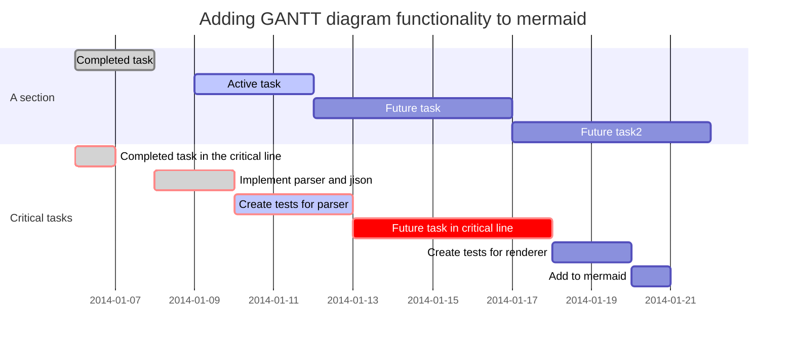

# Welcome to Smeagol!
Smeagol is a simple Wiki engine inspired by [Gollum](https://github.com/gollum/gollum/wiki). Gollum is a Wiki engine written in Ruby, which uses a number of simple text formats including [Markdown](http://daringfireball.net/projects/markdown/), and which uses [Git](http://git-scm.com/) to provide versioning and backup. I needed a new Wiki for a project and thought Gollum would be ideal - but unfortunately it doesn't provide user authentication, which I needed, and it was simpler for me to reimplement the bits I did need in Clojure than to modify Gollum.

So at this stage Smeagol is a Wiki engine written in Clojure which uses Markdown as its text format, which does have user authentication, and which uses Git as its versioning and backup system.

## Status
Smeagol is now a fully working small Wiki engine, and meets my own immediate needs.

## Markup syntax
Smeagol uses the Markdown format as provided by [markdown-clj](https://github.com/yogthos/markdown-clj), with the addition that anything enclosed in double square brackets, \[\[like this\]\], will be treated as a link into the wiki itself.

## Security and authentication
Security is now greatly improved. There is a file called *passwd* in the *resources* directory, which contains a clojure map which maps usernames to maps with plain-text passwords and emails thus:

    {:admin {:password "admin" :email "admin@localhost" :admin true}
     :adam {:password "secret" :email "adam@localhost"}}

that is to say, the username is a keyword and the corresponding password is a string. However, since version 0.5.0, users can now change their own passwords, and when the user changes their password their new password is encrypted using the [scrypt](http://www.tarsnap.com/scrypt.html) one-way encryption scheme. The password file is now no longer either in the *resources/public* directory so cannot be downloaded through the browser, nor in the git archive to which the Wiki content is stored, so that even if that git archive is remotely clonable an attacker cannot get the password file that way.

## Images
You can (if you're logged in) upload files, including images, using the **Upload a file** link on the top menu bar. You can link to an uploaded image, or other images already available on the web, like this:


## Now with data visualisation

Inspired by [visdown](http://visdown.amitkaps.com/) and [vega-lite](https://vega.github.io/vega-lite/docs/), you can now embed visualisations into Smeagol pages, like this:

### Flight punctuality at London airports

Example cribbed in its entirety from [here](http://visdown.amitkaps.com/london):
```vis
data:
  url: "data/london.csv"
transform:
 -
  filter: datum.year == 2016
mark: rect
encoding:
  x:
    type: nominal
    field: source
  y:
    type: nominal
    field: dest
  color:
    type: quantitative
    field: flights
    aggregate: sum
```

Data files can be uploaded in the same way as images, by using the **upload a file** link.

Note that this visualisation will not be rendered in the GitHub wiki, as it doesn't have Smeagol's data visualisation magic. This is what it should look like:


## Now with embedded graphs

Graphs can now be embedded in a page using the [Mermaid](http://knsv.github.io/mermaid/index.html) graph description language. The graph description should start with a line comprising three back-ticks and then the
word 'mermaid', and end with a line comprising just three backticks.

Here's an example culled from the Mermaid documentation.

### GANTT Chart



## Advertisement
If you like what you see here, I am available for work on open source Clojure projects.

### Phoning home
Smeagol currently requests the WEFT logo in the page footer from my home site. This is mainly so I can get a feel for how many people are using the product. If you object to this, edit the file

    resources/templates/base.html

and replace the line

     Developed by <a href="http://www.weft.scot/">WEFT</a>

with the line

     Developed by <a href="http://www.weft.scot/">WEFT</a>

## License
Copyright © 2014-2015 Simon Brooke. Licensed under the GNU General Public License,
version 2.0 or (at your option) any later version. If you wish to incorporate
parts of Smeagol into another open source project which uses a less restrictive
license, please contact me; I'm open to dual licensing it.

## Prerequisites
You will need [Leiningen](https://github.com/technomancy/leiningen) 2.0 or above installed.

You will need [node](https://nodejs.org/en/) and [bower](https://bower.io/) installed.

## Running
To start a web server for the application, run:

    lein bower install
    lein ring server

Alternatively, if you want to deploy to a servlet container (which I would strongly recommend), the simplest thing is to run:

    lein bower install
    lein ring uberwar

(a command which I'm sure Smeagol would entirely appreciate) and deploy the resulting war file.

## Experimental Docker image

You can now run Smeagol as a [Docker](http://www.docker.com) image. To run my Docker image, use

    docker run simonbrooke/smeagol

Smeagol will run, obviously, on the IP address of your Docker image, on port 8080. To find the IP address, start the image using the command above and then use

    docker inspect --format '{{ .NetworkSettings.IPAddress }}' $(docker ps -q)

Suppose this prints '10.10.10.10', then the URL to browse to will be http://10.10.10.10:8080/smeagol/

This image is _experimental_, but it does seem to work fairly well. What it does **not** yet do, however, is push the git repository to a remote location, so when you tear the Docker image down your edits will be lost. My next objective for this image is for it to have a cammand line parameter being the git address of a repository from which it can initialise the Wiki content, and to which it will periodically push local changes to the Wiki content.

To build your own Docker image, run:

    lein clean
    lein bower install
    lein ring uberwar
    lein docker build

This will build a new Docker image locally; you can, obviously, push it to your own Docker repository if you wish.
